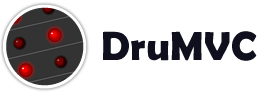

# 

### A (very) simple drum machine built in the major Javascript frameworks

Get to know the major Javascript frameworks with this simple drum machine. Currently in Angular, React, AngularJS and Vue.

## Links

[Website]()

[Twitter](https://twitter.com/drumvc)

## Credits

Drum samples from [producerspot.com](http://www.producerspot.com/download-free-edm-drums-drum-samples-kit-by-producerspot).

Inspired by [TodoMVC](https://github.com/tastejs/todomvc).

## License

MIT License. See the LICENSE file for details.

